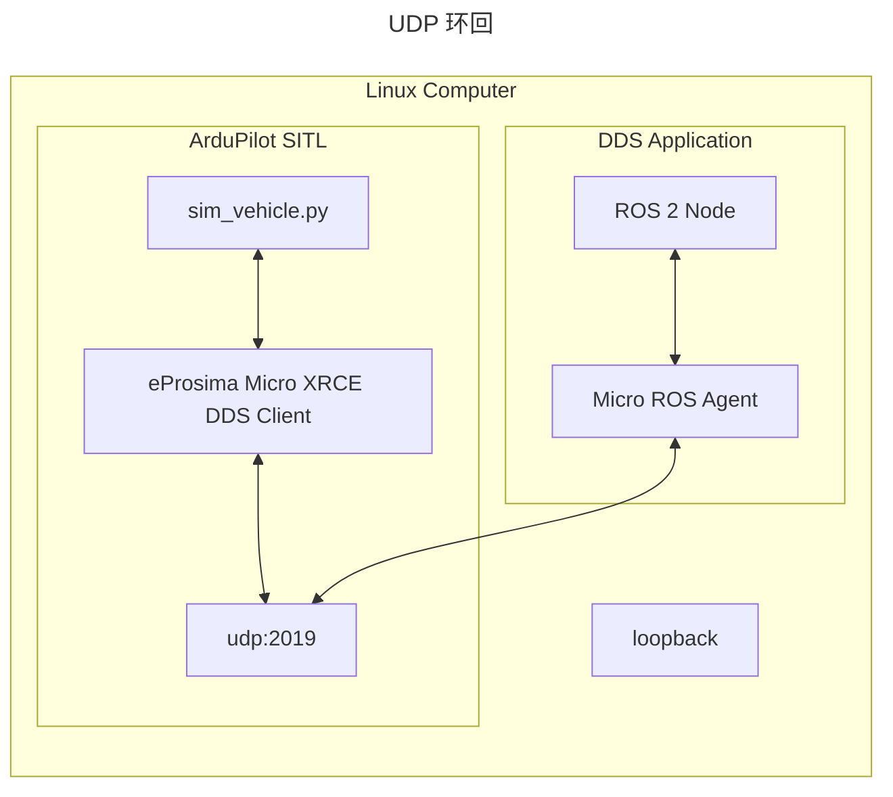
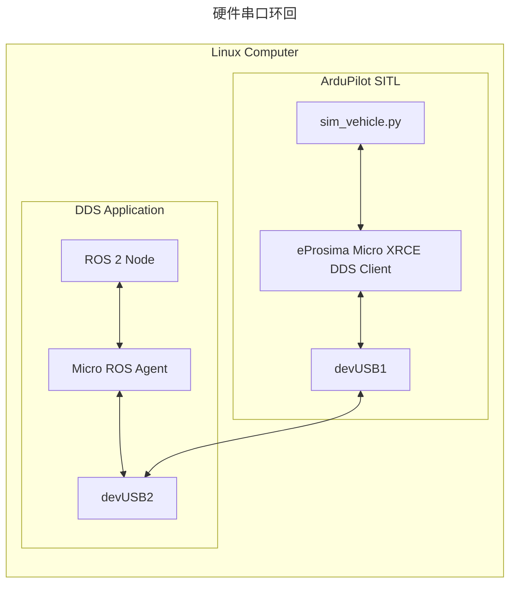

# 使用 DDS/micro-ROS 进行测试

## 架构

ArduPilot 内置 DDS Client 库，并且可以在 SITL 中运行。DDS 应用侧运行 ROS 2 节点和 micro-ROS Agent。两个系统可以通过串口或 UDP 通信。





## 安装构建依赖

ArduPilot 的 DDS 支持大部分通过 git submodule 提供，但系统中还需要安装另一个工具：Micro XRCE DDS Gen。

按 wiki 中的说明配置环境：[ROS 2 安装说明](https://ardupilot.org/dev/docs/ros2.html#installation-ubuntu)。

### 仅串口：为带 DDS 的 SITL 配置串口

在 Linux 上，如果要在 SITL 中使用串口，需要创建虚拟串口，因此需要安装 `socat`。

```console
sudo apt-get update
sudo apt-get install socat
```

## 为带 DDS 的 SITL 配置 ArduPilot

先配置好 [SITL](https://ardupilot.org/dev/docs/setting-up-sitl-on-linux.html)。然后用下面的命令运行仿真器。如果使用 UDP，只需要设置 `DDS_ENABLE` 参数。

| 名称 | 说明 | 默认值 |
| - | - | - |
| DDS_ENABLE | 设置为 1 启用 DDS，设置为 0 禁用 DDS | 1 |
| SERIAL1_BAUD | DDS 使用的串口波特率 | 57 |
| SERIAL1_PROTOCOL | 设置为 45 表示在该串口上使用 DDS | 0 |

```console
# 擦除参数，直到看到 "AP: ArduPilot Ready"
# 车辆类型可以替换为自己需要的类型
sim_vehicle.py -w -v ArduPlane --console -DG --enable-dds

# 仅串口模式需要设置；这里的 115 表示 115200 baud
param set SERIAL1_BAUD 115
# 参见 libraries/AP_SerialManager/AP_SerialManager.h 中的 AP_SerialManager SerialProtocol_DDS_XRCE
param set SERIAL1_PROTOCOL 45
```

如果 DDS 已经被编译进固件，则当前默认启用。要禁用它，执行下面的命令并重启仿真器。

```console
param set DDS_ENABLE 0
REBOOT
```

## 配置 ROS 2 和 micro-ROS

按下面步骤使用 micro-ROS Agent。

- 安装 ROS Humble：

  - https://docs.ros.org/en/humble/Installation/Ubuntu-Install-Debians.html

- 安装 `geographic_msgs`：

  ```console
  sudo apt install ros-humble-geographic-msgs
  ```

- 安装并运行 micro-ROS Agent。确保使用 `humble` 分支。

  - 按 [micro-ROS 教程](https://micro.ros.org/docs/tutorials/core/first_application_linux/)执行以下部分：

    - 执行 "Installing ROS 2 and the micro-ROS build system"
      - 跳过 docker run 命令，改成本地构建
    - 跳过 "Creating a new firmware workspace"
    - 跳过 "Building the firmware"
    - 执行 "Creating the micro-ROS agent"
    - Source 你的 ROS workspace

## 使用 ROS 2 CLI 读取 ArduPilot 数据

完成上述配置后，执行下面的步骤。

- Source ROS 2 安装环境：

  ```console
  source /opt/ros/humble/setup.bash
  ```

然后按所选 transport 的章节继续操作，最后就可以使用 ROS 2 CLI。

### UDP（SITL 推荐）

- 运行 micro-ROS Agent：

  ```console
  cd ardupilot/libraries/AP_DDS
  ros2 run micro_ros_agent micro_ros_agent udp4 -p 2019
  ```

- 运行 SITL。运行前记得先结束所有已有的 ArduPilot SITL 终端：

  ```console
  sim_vehicle.py -v ArduPlane -DG --console --enable-dds
  ```

### 串口

- 用 `socat` 启动虚拟串口。记下两个 `/dev/pts/*` 端口；如果你的端口号不同，后续命令相应替换。

  ```console
  socat -d -d pty,raw,echo=0 pty,raw,echo=0
  >>> 2023/02/21 05:26:06 socat[334] N PTY is /dev/pts/1
  >>> 2023/02/21 05:26:06 socat[334] N PTY is /dev/pts/2
  >>> 2023/02/21 05:26:06 socat[334] N starting data transfer loop with FDs [5,5] and [7,7]
  ```

- 运行 micro-ROS Agent：

  ```console
  cd ardupilot/libraries/AP_DDS
  # 假设 DDS 应用侧使用 tty/pts/2
  ros2 run micro_ros_agent micro_ros_agent serial -b 115200 -D /dev/pts/2
  ```

- 运行 SITL。运行前记得先结束所有已有的 ArduPilot SITL 终端：

  ```console
  # 假设 ArduPilot SITL 使用 /dev/pts/1
  sim_vehicle.py -v ArduPlane -DG --console --enable-dds -A "--serial1=uart:/dev/pts/1"
  ```

## 使用 ROS 2 CLI

应该可以看到 agent，并查看数据输出。

```bash
$ ros2 node list
/ardupilot_dds
```

```bash
$ ros2 topic list -v
Published topics:
 * /ap/battery [sensor_msgs/msg/BatteryState] 1 publisher
 * /ap/clock [rosgraph_msgs/msg/Clock] 1 publisher
 * /ap/geopose/filtered [geographic_msgs/msg/GeoPoseStamped] 1 publisher
 * /ap/gps_global_origin/filtered [geographic_msgs/msg/GeoPointStamped] 1 publisher
 * /ap/imu/experimental/data [sensor_msgs/msg/Imu] 1 publisher
 * /ap/navsat [sensor_msgs/msg/NavSatFix] 1 publisher
 * /ap/pose/filtered [geometry_msgs/msg/PoseStamped] 1 publisher
 * /ap/tf_static [tf2_msgs/msg/TFMessage] 1 publisher
 * /ap/time [builtin_interfaces/msg/Time] 1 publisher
 * /ap/twist/filtered [geometry_msgs/msg/TwistStamped] 1 publisher
 * /parameter_events [rcl_interfaces/msg/ParameterEvent] 1 publisher
 * /rosout [rcl_interfaces/msg/Log] 1 publisher

Subscribed topics:
 * /ap/cmd_gps_pose [ardupilot_msgs/msg/GlobalPosition] 1 subscriber
 * /ap/cmd_vel [geometry_msgs/msg/TwistStamped] 1 subscriber
 * /ap/joy [sensor_msgs/msg/Joy] 1 subscriber
 * /ap/tf [tf2_msgs/msg/TFMessage] 1 subscriber
```

```bash
$ ros2 topic hz /ap/time
average rate: 50.115
        min: 0.012s max: 0.024s std dev: 0.00328s window: 52
```

```bash
$ ros2 topic echo /ap/time
sec: 1678668735
nanosec: 729410000
```

```bash
$ ros2 service list
/ap/arm_motors
/ap/mode_switch
/ap/prearm_check
/ap/experimental/takeoff
---
```

启用传感器的静态变换也会被发布，可以这样接收：

```bash
ros2 topic echo /ap/tf_static --qos-depth 1 --qos-history keep_last --qos-reliability reliable --qos-durability transient_local --once
```

如果要消费这些变换，强烈建议在 ROS 2 中[创建并运行 transform broadcaster](https://docs.ros.org/en/humble/Concepts/About-Tf2.html#tutorials)。

## 使用 ROS 2 service

`AP_DDS` 库暴露的 service 会按 topic、message 和 service type 的命名约定自动映射到 ROS 2 service。早期版本的 `AP_DDS` 需要使用 eProsima [Integration Service](https://github.com/eProsima/Integration-Service) 将 DDS 的 request/reply topic 映射到 ROS 2，但现在不再需要。

列出可用 service：

```bash
$ ros2 service list -t
/ap/arm_motors [ardupilot_msgs/srv/ArmMotors]
/ap/mode_switch [ardupilot_msgs/srv/ModeSwitch]
/ap/prearm_check [std_srvs/srv/Trigger]
/ap/experimental/takeoff [ardupilot_msgs/srv/Takeoff]
```

调用解锁电机 service：

```bash
$ ros2 service call /ap/arm_motors ardupilot_msgs/srv/ArmMotors "{arm: True}"
requester: making request: ardupilot_msgs.srv.ArmMotors_Request(arm=True)

response:
ardupilot_msgs.srv.ArmMotors_Response(result=True)
```

调用模式切换 service：

```bash
$ ros2 service call /ap/mode_switch ardupilot_msgs/srv/ModeSwitch "{mode: 4}"
requester: making request: ardupilot_msgs.srv.ModeSwitch_Request(mode=4)

response:
ardupilot_msgs.srv.ModeSwitch_Response(status=True, curr_mode=4)
```

调用预解锁检查 service：

```bash
$ ros2 service call /ap/prearm_check std_srvs/srv/Trigger
requester: making request: std_srvs.srv.Trigger_Request()

response:
std_srvs.srv.Trigger_Response(success=False, message='Vehicle is Not Armable')

or

std_srvs.srv.Trigger_Response(success=True, message='Vehicle is Armable')
```

调用起飞 service：

```bash
$ ros2 service call /ap/experimental/takeoff ardupilot_msgs/srv/Takeoff "{alt: 10.5}"
requester: making request: ardupilot_msgs.srv.Takeoff_Request(alt=10.5)

response:
ardupilot_msgs.srv.Takeoff_Response(status=True)
```

## 使用 ROS 2 topic 发送控制命令

下面的 topic 可用于控制载具。

- `/ap/joy`（类型 `sensor_msgs/msg/Joy`）：最多覆盖 8 个 RC 通道，至少需要发送 4 个 axis。数值会被限制在 -1.0 到 1.0 之间。使用 `NaN` 可以禁用某一个通道的覆盖。如果 1 秒内没有收到命令，该通道会恢复为 RC 控制。

```bash
ros2 topic pub /ap/joy sensor_msgs/msg/Joy "{axes: [0.0, 0.0, 0.0, 0.0]}"

publisher: beginning loop
publishing #1: sensor_msgs.msg.Joy(header=std_msgs.msg.Header(stamp=builtin_interfaces.msg.Time(sec=0, nanosec=0), frame_id=''), axes=[0.0, 0.0, 0.0, 0.0], buttons=[])
```

- `/ap/cmd_gps_pose`（类型 `ardupilot_msgs/msg/GlobalPosition`）：在当前选择的模式为 GUIDED 时，发送一个目标航点。

```bash
ros2 topic pub /ap/cmd_gps_pose ardupilot_msgs/msg/GlobalPosition "{latitude: 34, longitude: 118, altitude: 1000}"

publisher: beginning loop
publishing #1: ardupilot_msgs.msg.GlobalPosition(header=std_msgs.msg.Header(stamp=builtin_interfaces.msg.Time(sec=0, nanosec=0), frame_id=''), coordinate_frame=0, type_mask=0, latitude=34.0, longitude=118.0, altitude=1000.0, velocity=geometry_msgs.msg.Twist(linear=geometry_msgs.msg.Vector3(x=0.0, y=0.0, z=0.0), angular=geometry_msgs.msg.Vector3(x=0.0, y=0.0, z=0.0)), acceleration_or_force=geometry_msgs.msg.Twist(linear=geometry_msgs.msg.Vector3(x=0.0, y=0.0, z=0.0), angular=geometry_msgs.msg.Vector3(x=0.0, y=0.0, z=0.0)), yaw=0.0)
```

## 参与 `AP_DDS` 库开发

### 向 ArduPilot 添加 DDS 消息

ArduPilot 原生支持 DDS，因此消息文件不是直接使用 ROS 2 `.msg` 文件，而是使用 [OMG IDL DDS v4.2](https://www.omg.org/spec/IDL/4.2/PDF)。这个包的目标是支持任何符合这些扩展的 `.idl` 文件。

随着时间推移，这些限制理想情况下会逐步消失。

如果要从 ROS 2 获取新的 IDL 文件，按下面流程操作：

```bash
cd ardupilot
source /opt/ros/humble/setup.bash

# 查找 IDL 文件
find /opt/ros/$ROS_DISTRO -type f -wholename \*builtin_interfaces/msg/Time.idl

# 如果源码树中还没有对应目录，按 ROS 目录结构创建
mkdir -p libraries/AP_DDS/Idl/builtin_interfaces/msg/

# 复制 IDL
cp /opt/ros/humble/share/builtin_interfaces/msg/Time.idl libraries/AP_DDS/Idl/builtin_interfaces/msg/

# 按前文说明带 `--enable-dds` 重新构建代码
```

如果消息是 ArduPilot 自定义消息，先在 `Tools/ros2/ardupilot_msgs/msg/GlobalPosition.msg` 这类位置创建 ROS message。然后用 `colcon` 构建 `ardupilot_msgs`。最后把 install 目录中的 IDL 文件夹复制到源码树中。

### 新增 DDS 消息的详细步骤

新增 topic 或 service 时，先确认三件事：接口类型、通信方向、ArduPilot 内部消费或生产数据的代码路径。

1. 选择接口来源。
   - 标准 ROS 2 类型：从 `/opt/ros/$ROS_DISTRO/share/<package>/<msg|srv>/` 复制对应 `.idl` 到 `libraries/AP_DDS/Idl/<package>/<msg|srv>/`。
   - ArduPilot 自定义类型：先在 `Tools/ros2/ardupilot_msgs/msg/` 或 `Tools/ros2/ardupilot_msgs/srv/` 添加 `.msg`/`.srv`，用 `colcon` 构建，再把生成的 `.idl` 复制到 `libraries/AP_DDS/Idl/ardupilot_msgs/...`。
   - 如果该 IDL `#include` 了其他 IDL，也要把依赖文件一起放入 `libraries/AP_DDS/Idl/` 下的相同包路径中。

2. 重新生成 DDS 类型代码。
   - `libraries/AP_DDS/wscript` 会扫描 `libraries/AP_DDS/Idl/**/*.idl`。
   - 带 `--enable-dds` 构建时，`microxrceddsgen` 会把 IDL 生成到 build 目录的 `libraries/AP_DDS/generated/...`，并把生成的 `.c` 加入 `AP_DDS` 库。
   - 常用检查命令：

     ```bash
     ./waf configure --board sitl --enable-dds
     ./waf rover -j4
     ```

3. 增加编译开关和类型依赖。
   - 在 `libraries/AP_DDS/AP_DDS_config.h` 中增加 `AP_DDS_<FEATURE>_ENABLED`。
   - 发布型 topic 通常还需要 `AP_DDS_DELAY_<FEATURE>_TOPIC_MS`。
   - 如果 `AP_DDS_Client.h` 中的 include 被 `AP_DDS_NEEDS_*` 宏保护，记得把新功能加入对应宏，例如复用 `TwistStamped` 时加入 `AP_DDS_NEEDS_TWIST`。

4. 在 topic 或 service 表中登记接口。
   - topic 加到 `libraries/AP_DDS/AP_DDS_Topic_Table.h`：
     - 在 `TopicIndex` 中增加枚举值。
     - 在 `AP_DDS_Client::topics[]` 中增加表项。
     - 发布给 ROS 2 的 topic 用 `Topic_rw::DataWriter`；从 ROS 2 接收的 topic 用 `Topic_rw::DataReader`。
     - ROS 2 topic 名映射到 DDS 时需要 `rt/` 前缀，例如 ROS 2 的 `/ap/time` 对应 DDS 的 `rt/ap/time`。
     - `type_name` 使用 ROS 2 到 DDS 的 mangled 名称，例如 `geometry_msgs::msg::dds_::TwistStamped_`。
     - 根据链路和数据语义选择 QoS；高频传感器或控制观测通常使用 `BEST_EFFORT`，需要可靠送达的状态或 service 使用 `RELIABLE`。
   - service 加到 `libraries/AP_DDS/AP_DDS_Service_Table.h`：
     - 在 `ServiceIndex` 中增加枚举值。
     - 在 `AP_DDS_Client::services[]` 中增加表项。
     - service 需要 request/response 类型成对出现，并按 `rs/`、`rq/`、`rr/` 命名规则填写 service、request topic 和 reply topic。

5. 在 `AP_DDS_Client.h` 中增加消息缓存和函数声明。
   - 发布型 topic：增加 `static <type> tx_<name>_topic`，声明 `update_topic(...)` 和写 topic 的函数。
   - 订阅型 topic：增加 `static <type> rx_<name>_topic`。
   - service：按已有 service 模式增加 request/response 结构或复用已有静态缓存，注意较大的消息不要放在回调栈上。

6. 在 `AP_DDS_Client.cpp` 中实现收发逻辑。
   - 发布型 topic：
     - `update_topic(...)` 从 ArduPilot 内部状态填充 ROS 消息，设置 `header.stamp`、`frame_id`，并处理 NED/ENU、FRD/FLU 等坐标系转换。
     - 增加 `write_<name>_topic()`，用生成代码中的 `<type>_size_of_topic()`、`<type>_serialize_topic()` 和 `finalize_topic_write()` 发送。
     - 在 `AP_DDS_Client::update()` 中按 delay 周期调用填充和发送函数。
   - 订阅型 topic：
     - 在 `AP_DDS_Client::on_topic()` 的 `switch (object_id.id)` 中增加 case。
     - 用生成代码中的 `<type>_deserialize_topic()` 反序列化到 `rx_<name>_topic`。
     - 先校验 `frame_id`、数值是否 finite、取值范围和掩码，再转换到 ArduPilot 内部坐标系或单位。
     - 调用目标子系统，例如外部控制、AHRS、EKF、RC override 等。
   - service：
     - 在 `AP_DDS_Client::on_request()` 中增加对应 case。
     - 反序列化 request，调用 ArduPilot 内部逻辑，填充 response。
     - 用 `<response_type>_serialize_topic()` 和 `uxr_buffer_reply()` 返回。

7. 为非平凡转换增加独立 helper 或类型转换函数。
   - 通用类型转换放到 `AP_DDS_Type_Conversions.*`。
   - 业务逻辑较独立时可以像 `AP_DDS_ExternalControl.*` 一样新增 helper，避免把坐标系校验和业务调用全部塞进 `AP_DDS_Client.cpp`。

8. 更新文档和验证命令。
   - 在本 README 中补充新 topic/service 的 ROS 2 名称、类型、方向、frame 要求和示例命令。
   - 运行格式化：

     ```bash
     ./Tools/CodeStyle/ardupilot-astyle.sh libraries/AP_DDS/*.h libraries/AP_DDS/*.cpp
     ```

   - 运行最小相关构建，并用 `ros2 topic list -v`、`ros2 topic echo`、`ros2 topic pub` 或 `ros2 service call` 验证端到端行为。

当前本地新增的外部导航速度订阅可以作为订阅型 topic 示例：

1. 复用已有 `geometry_msgs/msg/TwistStamped.idl`，因此不需要新增 IDL。
2. 在 `AP_DDS_config.h` 中增加 `AP_DDS_EXTNAV_VEL_SUB_ENABLED`，并把它加入 `AP_DDS_NEEDS_TWIST`。
3. 在 `AP_DDS_Topic_Table.h` 中增加 `EXTNAV_VELOCITY_SUB` 表项：
   - ROS 2 名称：`/ap/extnav/velocity`
   - DDS 名称：`rt/ap/extnav/velocity`
   - 类型：`geometry_msgs::msg::dds_::TwistStamped_`
   - 方向：`Topic_rw::DataReader`
   - QoS：`BEST_EFFORT`、`KEEP_LAST`、depth 5
4. 在 `AP_DDS_Client.h/.cpp` 中增加 `rx_extnav_velocity_topic`，在 `on_topic()` 中反序列化 `TwistStamped`。
5. 在参数表中增加外部导航速度观测的不确定度和延迟参数，例如 `DDS_EXTVEL_ERR`、`DDS_EXTVEL_DLY`。
6. 在 `AP_DDS_ExternalNav.*` 中校验 `frame_id == base_link`、速度和误差为有限值，并把 ROS `base_link` 的 FLU 速度转换为 ArduPilot body-frame FRD，再通过 AHRS 转到 NED。
7. 最后调用 `AP::ahrs().writeExtNavVelData(velocity_ned, velocity_error, now_ms, delay_ms)` 注入外部导航速度观测。
8. 端到端验证可用：

   ```bash
   ros2 topic pub /ap/extnav/velocity geometry_msgs/msg/TwistStamped "{header: {frame_id: base_link}, twist: {linear: {x: 1.0, y: 0.0, z: 0.0}, angular: {z: 0.0}}}"
   ```

### 添加 topic 和 service 的规则

只要定义 topic 和 service 表项时遵守一些规则，`AP_DDS` 中可用的 topic 和 service 就会自动映射到 ROS 2。

#### ROS 2 message 和 service interface 类型

ROS 2 message 和 interface 定义在从 ROS 2 映射到 DDS 时，会被 `rosidl_adapter` 改名，以避免 C/C++ 库中的命名冲突。ROS 2 对象 `namespace::Struct` 会被改名为 DDS 中的 `namespace::dds_::Struct_`。下面是一些映射示例：

| ROS 2 | DDS |
| --- | --- |
| `rosgraph_msgs::msg::Clock` | `rosgraph_msgs::msg::dds_::Clock_` |
| `sensor_msgs::msg::NavSatFix` | `sensor_msgs::msg::dds_::NavSatFix_` |
| `ardupilot_msgs::srv::ArmMotors_Request` | `ardupilot_msgs::srv::dds_::ArmMotors_Request_` |
| `ardupilot_msgs::srv::ArmMotors_Response` | `ardupilot_msgs::srv::dds_::ArmMotors_Response_` |

注意，service interface 一定需要 Request/Response 成对出现。

#### ROS 2 topic 和 service 名称

ROS 2 设计文章 [Topic and Service name mapping to DDS](https://design.ros2.org/articles/topic_and_service_names.html) 描述了 ROS 2 topic 和 service 名称到 DDS 的映射。每个 ROS 2 子系统映射到 DDS 时都会带一个前缀。service 的 request/response 对还需要额外后缀。

| ROS 2 子系统 | DDS 前缀 | DDS 后缀 |
| --- | --- | --- |
| topic | rt/ | |
| service request | rq/ | Request |
| service response | rr/ | Reply |
| service | rs/ | |
| parameter | rp/ | |
| action | ra/ | |

下面是 topic 和 service 的映射示例：

| ROS 2 | DDS |
| --- | --- |
| ap/clock | rt/ap/clock |
| ap/navsat | rt/ap/navsat |
| ap/arm_motors | rq/ap/arm_motorsRequest, rr/ap/arm_motorsReply |

更多细节可以参考现有映射：

- [`AP_DDS_Topic_Table`](https://github.com/ArduPilot/ardupilot/blob/master/libraries/AP_DDS/AP_DDS_Topic_Table.h)
- [`AP_DDS_Service_Table`](https://github.com/ArduPilot/ardupilot/blob/master/libraries/AP_DDS/AP_DDS_Service_Table.h)

### 开发要求

`AP_DDS` 中的 C++ 代码使用 Astyle 格式化。CI 构建通过需要满足这个格式。参见 [Tools/CodeStyle/ardupilot-astyle.sh](../../Tools/CodeStyle/ardupilot-astyle.sh)。

```bash
./Tools/CodeStyle/ardupilot-astyle.sh libraries/AP_DDS/*.h libraries/AP_DDS/*.cpp
```

其他内容，例如 Python 和 XML 代码格式化，使用 pre-commit。提交时它会自动运行相关工具。如果 pre-commit 修改了文件，把这些修改重新加入 staging index 后再次提交即可。

1. 安装 [pre-commit](https://pre-commit.com/#installation) Python 包。
1. 在仓库根目录安装 ArduPilot hooks，然后正常提交。

   ```bash
   cd ardupilot
   pre-commit install
   git commit
   ```

## 在硬件上测试 DDS

### 使用串口

测试 DDS 最简单的方法，是使用一些通过 USB 提供两个串口接口的板子，例如 Pixhawk 6X。[Pixhawk6X/hwdef.dat](../AP_HAL_ChibiOS/hwdef/Pixhawk6X/hwdef.dat) 文件中有这些信息：

```text
SERIAL_ORDER OTG1 UART7 UART5 USART1 UART8 USART2 UART4 USART3 OTG2
```

例如，构建、刷写，并把 OTG2 配置为 DDS：

```bash
./waf configure --board Pixhawk6X --enable-dds
./waf plane --upload
mavproxy.py --console
param set DDS_ENABLE 1
# 查看 hwdef 文件确认 OTG2 对应哪个 SERIALx
param set SERIAL8_PROTOCOL 45
param set SERIAL8_BAUD 115
reboot
```

然后运行 Micro ROS Agent：

```bash
cd /path/to/ros2_ws
source install/setup.bash
cd src/ardupilot/libraries/AP_DDS
ros2 run micro_ros_agent micro_ros_agent serial -b 115200 -D /dev/serial/by-id/usb-ArduPilot_Pixhawk6X_210028000151323131373139-if02
```

如果连接失败，不要先运行 Micro ROS Agent，可以先调试数据流：

```bash
python3 -m serial.tools.miniterm /dev/serial/by-id/usb-ArduPilot_Pixhawk6X_210028000151323131373139-if02  115200 --echo --encoding hexlify
```

上述流程跑通后，也可以对物理串口执行相同步骤，以隔离软件和硬件问题。
